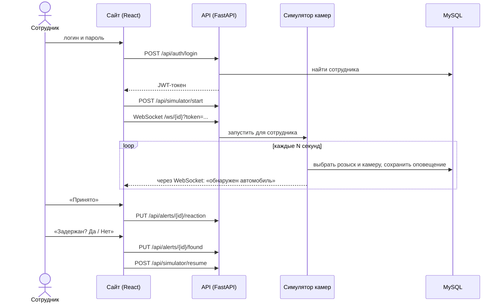
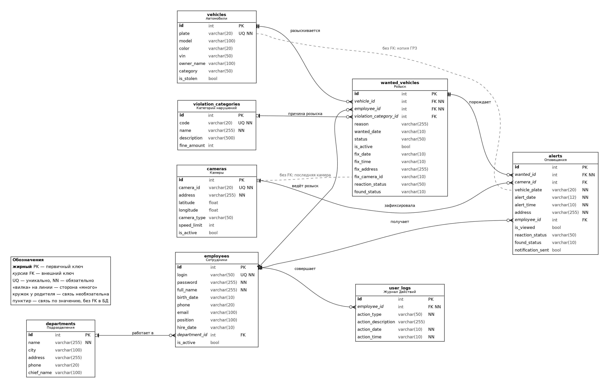

# Система оперативного розыска ГИБДД 

Учебный проект: веб-приложение, в котором сотрудник ГИБДД ведёт список разыскиваемых автомобилей и получает оповещение, когда камера «видит» один из них. Камеры в проекте **имитирует симулятор** на сервере, реальных камер нет.

Здесь только веб-часть: `backend` (API) и `web-frontend` (сайт). Мобильное приложение в репозиторий не входит.

## Как это работает

1. Сотрудник входит по логину и паролю, сервер выдаёт JWT-токен.
2. После входа сайт запускает на сервере симулятор камер для этого сотрудника и открывает WebSocket.
3. Раз в интервал (по умолчанию 60 с) симулятор выбирает случайный автомобиль из розыска этого сотрудника и случайную камеру, сохраняет оповещение в БД, отправляет его на сайт и на почту.
4. На сайте появляется окно «Обнаружен автомобиль», открывается карта с подсвеченной камерой.
5. После «Принято» через минуту сайт спрашивает «Автомобиль задержан?». «Да» меняет статус на «Найден», «Нет» возвращает «В розыске», и симулятор продолжает поиск.



## ER-диаграмма базы данных



Файлы: [PNG](docs/er-diagram.png), [SVG](docs/er-diagram.svg), исходник [DOT](docs/er-diagram.dot). Диаграмма построена по `backend/app/models.py`.

| Таблица | Назначение |
|---|---|
| `departments` | Подразделения ГИБДД |
| `employees` | Сотрудники: логин, пароль, ФИО, должность, подразделение |
| `vehicles` | Автомобили: ГРЗ (уникален), модель, цвет, VIN |
| `violation_categories` | Справочник причин розыска (угон, ДТП и т. д.) |
| `wanted_vehicles` | Записи розыска: какой автомобиль, кто ведёт, причина, статус, где и когда замечен |
| `cameras` | Камеры видеофиксации с координатами |
| `alerts` | Оповещения: что и где обнаружено, реакция сотрудника, найден или нет |
| `user_logs` | Журнал действий пользователей. Таблица создана, но в коде пока не используется |

Важно знать:
- У автомобиля может быть несколько записей в `wanted_vehicles` (история), но **активная только одна**.
- `alerts.vehicle_plate` и `alerts.address` хранят копию значений на момент оповещения. Это сделано намеренно, чтобы история не менялась при правке справочников.
- `wanted_vehicles.fix_camera_id` ссылается на камеру по значению, внешнего ключа нет.

## Технологии

- **Backend:** Python, FastAPI, SQLAlchemy, MySQL, WebSocket
- **Frontend:** React 18, React Router, Tailwind CSS

## Структура

```
backend/            API на FastAPI
  app/main.py         точка входа, подключение роутов, WebSocket
  app/models.py       модели таблиц БД
  app/routes/         эндпойнты: auth, wanted, alerts, cameras, employees, vehicles, simulator
  app/services/       симулятор камер и отправка почты
  seed.py             наполнение БД тестовыми данными
web-frontend/       сайт на React
  src/pages/          страницы
  src/contexts/       приём оповещений по WebSocket
  public/             карта города и 15 вариантов карты с подсвеченной камерой
docs/               ER-диаграмма
```

## Запуск

Нужны Python 3.12, Node.js 18+ и MySQL.

**1. База данных**
```sql
CREATE DATABASE gibdd_db CHARACTER SET utf8mb4;
```

**2. Backend**
```bash
cd backend
cp .env.example .env          # впишите свой пароль к MySQL и SECRET_KEY
python -m venv venv
venv\Scripts\activate         # Windows;  Linux/Mac: source venv/bin/activate
pip install -r requirements.txt
python seed.py                # создаёт таблицы и тестовые данные
uvicorn app.main:app --reload --port 8000
```
Проверка: http://localhost:8000/ , документация API: http://localhost:8000/docs

**3. Frontend**
```bash
cd web-frontend
cp .env.example .env
npm install
npm start
```
Сайт откроется на http://localhost:3000.

**Тестовые сотрудники** (создаёт `seed.py`):

| Логин | Пароль | Должность |
|---|---|---|
| `ivanov_ai` | `Ivanov2024` | Инспектор ДПС |
| `petrova_ea` | `Petrova2024` | Инспектор ДПС |
| `sidorov_mk` | `Sidorov2024` | Старший инспектор |
| `kuznetsova_ov` | `Kuznec2024` | Инспектор ДПС |
| `belozerov_rv` | `Admin2024` | Администратор |

**Режим демонстрации.** Чтобы не ждать минуту, поставьте `DETECTION_INTERVAL_SECONDS=10` в `backend/.env` и `REACT_APP_FOUND_PROMPT_DELAY_MS=10000` в `web-frontend/.env`, затем перезапустите оба сервера.

## Страницы и кнопки

| Страница | Кнопка | Что происходит |
|---|---|---|
| Вход | «Войти в систему» | Проверка логина и пароля, переход на главную |
| Главная | «Принято» / «Отклонить» | Сохраняет реакцию на ожидающее оповещение |
| Мой розыск | «+ Добавить в розыск» | Два шага: выбор ГРЗ, затем причины |
| Мой розыск | «Удалить из розыска» | Удаляет выбранную строку после подтверждения |
| База розыска | «Взять себе» | Передаёт розыск чужого автомобиля вам |
| Карта | «Увеличить» / «Уменьшить» / «Сброс» | Масштаб карты |
| Карта | «Снять подсветку» | Возврат к общей карте |
| История | «Сегодня» / «Неделя» / «Месяц» | Фильтр оповещений по периоду |
| Окно оповещения | «Принято», затем «Да» / «Нет» | Реакция и итог: задержан или нет |
| Меню слева | Значок выхода | Останавливает симулятор и выходит из системы |

## Известные ограничения

- Пароли сотрудников хранятся в БД открытым текстом, для реального использования нужно хеширование (bcrypt).
- Камеры имитируются случайным выбором, а не распознаванием номеров.
- Файл `.env` с секретами в репозиторий не входит, используйте `.env.example`.
