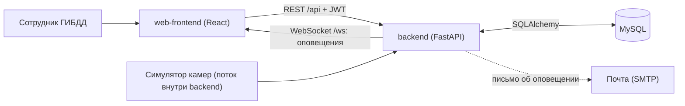
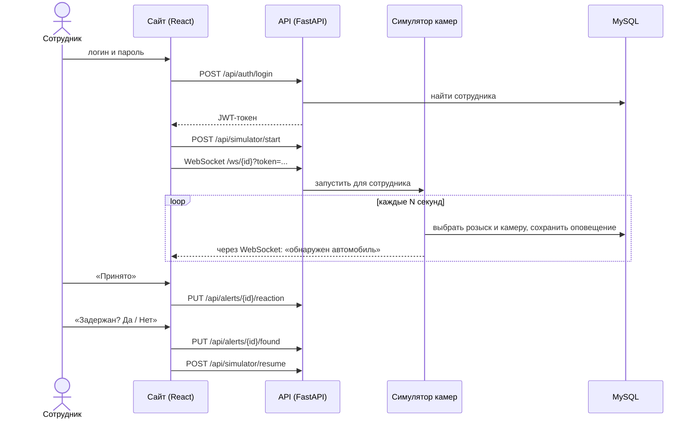

# Система оперативного розыска ГИБДД

Учебный проект: веб-приложение, в котором сотрудник ГИБДД ведёт список разыскиваемых автомобилей и получает оповещение, когда камера «видит» один из них. Реальных камер нет: их имитирует **симулятор** на сервере.

Репозиторий содержит две части. У каждой есть свой README и своя папка `docs/` с подробной документацией.

| Часть | Что это | README | Документация |
|---|---|---|---|
| [`backend/`](backend) | REST API и WebSocket на FastAPI, база MySQL, симулятор камер | [backend/README.md](backend/README.md) | [backend/docs/](backend/docs) |
| [`web-frontend/`](web-frontend) | Веб-интерфейс сотрудника на React | [web-frontend/README.md](web-frontend/README.md) | [web-frontend/docs/](web-frontend/docs) |

Мобильное приложение в этот репозиторий не входит.

## Как части связаны между собой



- Фронтенд не хранит бизнес-данных: всё, что он показывает, он запрашивает у backend, а действия пользователя отправляет туда же.
- Все правила розыска проверяет **backend**. Фронтенд лишь удобно показывает результат и подсказывает ошибки.
- Оповещения идут только в одну сторону и в реальном времени: симулятор → backend → WebSocket → браузер сотрудника.
- Контракт между частями (маршруты, форматы) описан в [backend/docs/api.md](backend/docs/api.md).

## Как проходит оповещение



## Бизнес-правила

Правила хранения и проверки находятся в backend ([`routes/`](backend/app/routes) и [`services/simulator.py`](backend/app/services/simulator.py)).

### Розыск

1. **Одна активная запись на автомобиль.** Поставить в розыск автомобиль, у которого уже есть активная запись (у любого сотрудника), нельзя.
2. **Только известные автомобили.** В розыск ставятся автомобили из справочника `vehicles`; ГРЗ вне справочника отклоняется.
3. **Причина розыска.** Берётся из справочника причин. Если введена другая, создаётся новая категория.
4. **У записи один владелец** сотрудник, который поставил автомобиль в розыск или взял его себе. Снять с розыска может только он.
5. **Передача розыска.** Сотрудник может взять чужой розыск себе. Запись прежнего владельца закрывается (статус «Передан»), создаётся новая, данные последней фиксации автомобиля переносятся. Нельзя взять свою запись или запись, которая уже не «В розыске».
6. **Снятие не стирает данные.** Запись получает статус «Удален» и остаётся в базе как история.

### Оповещения

7. **Оповещения создаёт симулятор** только по автомобилям **вошедшего** сотрудника, которые в розыске и ещё не задержаны, и только с активных камер.
8. **Одно оповещение за раз.** После оповещения симулятор ждёт ответа сотрудника и ничего не создаёт.
9. **Оповещение видит только адресат.** Менять и смотреть чужие оповещения нельзя.
10. **Реакция сотрудника.** Он принимает оповещение («Принято») или отклоняет («Отклонено»; это можно сделать на главной странице).
11. **Результат розыска.** После «Принято» сотрудника спрашивают «Автомобиль задержан?».
    «Да» переводит запись в статус «Найден», и оповещения по ней прекращаются.
    «Нет» оставляет статус «В розыске», поиск продолжается.
12. **Письмо.** Если настроена почта и у сотрудника есть адрес, о каждом оповещении отправляется письмо.

### История и отчёты

13. **История** показывает оповещения только текущего сотрудника, от новых к старым, не больше 200. Период: сегодня, неделя (7 дней), месяц (30 дней) или всё время.
14. **Отчёты.** Историю можно выгрузить в Word или Excel.

### Доступ

15. **Вход по логину и паролю.** Отключённый сотрудник войти не может. После входа выдаётся токен на 30 минут, затем нужно войти снова.
16. **Права одинаковы у всех сотрудников.** Должность («Администратор», «Инспектор ДПС») нигде не влияет на доступ.

### Статусы

| Что | Значения | Когда |
|---|---|---|
| Запись розыска | `В розыске` | Поставлена в розыск, или результат розыска «Нет» |
| | `Найден` | Сотрудник ответил, что автомобиль задержан |
| | `Передан` | Розыск взял другой сотрудник |
| | `Удален` | Владелец снял автомобиль с розыска |
| Реакция на оповещение | `Ожидает` | Оповещение создано, ответа нет |
| | `Принято`, `Отклонено` | Ответ сотрудника |
| Результат | `Да`, `Нет` | Задержан ли автомобиль |
| Статус в истории | `Найден`, `Принято`, `Отклонено`, `Ожидает` | Выводится из реакции и результата, «Найден» главнее остальных |

## ER-диаграмма


Файлы: [PNG](docs/er-diagram.png), [SVG](docs/er-diagram.svg), исходник [DOT](docs/er-diagram.dot). Диаграмма построена по [`backend/app/models.py`](backend/app/models.py). Все поля и связи с пояснениями: [backend/docs/database.md](backend/docs/database.md).

| Таблица | Назначение |
|---|---|
| `departments` | Подразделения ГИБДД |
| `employees` | Сотрудники: логин, пароль, ФИО, должность, подразделение |
| `vehicles` | Автомобили: ГРЗ (уникален), модель, цвет |
| `violation_categories` | Справочник причин розыска |
| `wanted_vehicles` | Записи розыска: автомобиль, владелец, причина, статус, где и когда замечен |
| `cameras` | Камеры видеофиксации с координатами |
| `alerts` | Оповещения: что, где и кому, реакция и результат |
| `user_logs` | Журнал действий (создаётся, но в коде пока не используется) |

# 1. База (в MySQL): CREATE DATABASE gibdd_db CHARACTER SET utf8mb4;

# 2. Backend
cd backend
py -3.12 -m venv venv
venv\Scripts\activate
pip install -r requirements.txt
copy .env.example .env # впишите пароль MySQL и SECRET_KEY
copy seed_users.example.json seed_users.json # тестовые сотрудники
python seed.py
python -m uvicorn app.main:app --reload --port 8000

# 3. Frontend (в другом окне)
cd web-frontend
copy .env.example .env
npm install
npm start

Сайт: http://localhost:3000, документация API: http://localhost:8000/docs.

**Тестовые сотрудники.** Логины и пароли лежат не в коде, а в файле `backend/seed_users.json`. Шаблон с данными для демонстрации: [`backend/seed_users.example.json`](backend/seed_users.example.json). Настоящий `seed_users.json` в git не попадает.

**Демонстрационный режим.** Чтобы не ждать минуту до оповещения: `DETECTION_INTERVAL_SECONDS=10` в `backend/.env` и `REACT_APP_FOUND_PROMPT_DELAY_MS=10000` в `web-frontend/.env`.

## Структура репозитория

```
backend/            API, симулятор, база; README и docs/
web-frontend/       веб-интерфейс; README и docs/
docs/               материалы по проекту в целом (ER-диаграмма)
```

## Известные ограничения

- Пароли хранятся в базе открытым текстом, CORS открыт для всех адресов, HTTPS нет. Для учебного проекта допустимо, для боевого нужно исправить: [backend/docs/security.md](backend/docs/security.md).
- Камеры имитируются случайным выбором, а не распознаванием номеров.
- Оповещения приходят, пока страница открыта (WebSocket); при закрытой странице остаётся только письмо.
- Автоматических тестов у веб-интерфейса нет, ручной чек-лист: [web-frontend/docs/testing.md](web-frontend/docs/testing.md).
