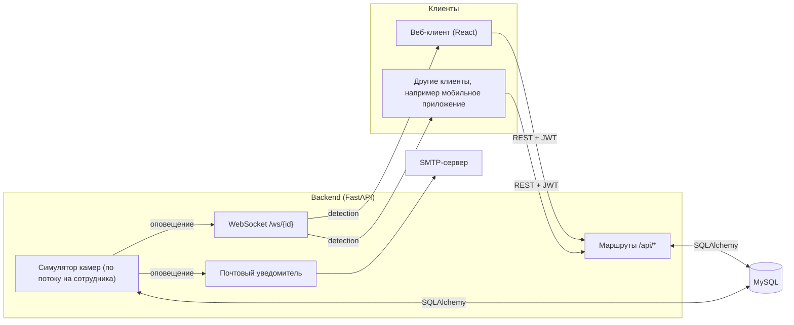

# Архитектура backend

Backend написан на **FastAPI**: это асинхронный веб-фреймворк, который по аннотациям Python сам проверяет запросы и строит документацию (`/docs`). Данные хранятся в **MySQL**, доступ к ним через **SQLAlchemy**.

## Общая схема



## Структура кода

```
backend/
  seed.py                  наполнение БД тестовыми данными
  seed_data.py             загрузка тестовых сотрудников из JSON
  seed_users.example.json  шаблон тестовых сотрудников
  requirements.txt
  tests/                   автотесты (unittest)
  app/
    main.py                создание приложения, подключение маршрутов, WebSocket
    database.py            подключение к БД, сессии (get_db)
    models.py              таблицы (SQLAlchemy)
    schemas.py             форматы запросов и ответов (Pydantic)
    auth.py                JWT: создание токена, get_current_user
    runtime.py             общий event loop для потока симулятора
    routes/                HTTP-маршруты: auth, employees, vehicles, wanted, alerts, cameras, simulator
    services/
      simulator.py         симулятор камер
      email.py             отправка писем
      export.py            сборка отчётов Word и Excel
    websocket/manager.py   хранение WebSocket-соединений
```

## Слои

| Слой | Файлы | Задача |
|---|---|---|
| Маршруты | `routes/*.py` | Принять запрос, проверить права, выполнить правило, вернуть ответ. Правила предметной области (например, «одна активная запись розыска на автомобиль») находятся здесь |
| Схемы | `schemas.py` | Описывают формат JSON; FastAPI по ним проверяет входные данные и формирует ответ |
| Модели | `models.py` | Таблицы базы данных и связи между ними, см. [database.md](database.md) |
| Сервисы | `services/*.py` | Независимая от HTTP логика: симулятор, письма, отчёты |
| Инфраструктура | `database.py`, `auth.py`, `runtime.py`, `websocket/` | Подключение к БД, токены, связь потока симулятора с WebSocket |

## Жизненный цикл приложения

При старте (`lifespan` в `main.py`) сервер:

1. создаёт в БД недостающие таблицы (`Base.metadata.create_all`);
2. запоминает главный event loop в `runtime.main_loop`, чтобы поток симулятора мог отправлять сообщения в WebSocket.

## Как оповещение доходит до клиента

Симулятор работает в **отдельном потоке** (обычный `threading.Thread`), а WebSocket живёт в **event loop** FastAPI. Поэтому поток не может просто вызвать `await`:

1. Поток симулятора находит разыскиваемый автомобиль, создаёт запись `alerts` и вызывает колбэк `_on_detected` (`routes/simulator.py`).
2. Колбэк передаёт сообщение в event loop через `asyncio.run_coroutine_threadsafe(...)` (поэтому нужен `runtime.main_loop`).
3. `ConnectionManager.send_personal_message` отправляет JSON на WebSocket этого сотрудника.
4. Параллельно, если у сотрудника есть почта и настроен SMTP, письмо уходит в отдельном потоке.

Подробности алгоритма: [simulator.md](simulator.md). Формат сообщения: [api.md](api.md#websocket-оповещения-в-реальном-времени).

## Соединения WebSocket

`ConnectionManager` хранит по одному соединению на сотрудника. Если сотрудник открыл страницу повторно (или React в режиме разработки смонтировал компонент дважды), новое соединение заменяет старое, а закрытие старого не удаляет новое: при отключении сравнивается именно объект соединения.

## Работа с базой

Каждый запрос получает собственную сессию через зависимость `get_db` и закрывает её по завершении. Поток симулятора создаёт свои сессии (`SessionLocal`) на каждый шаг, потому что сессии SQLAlchemy нельзя разделять между потоками.
