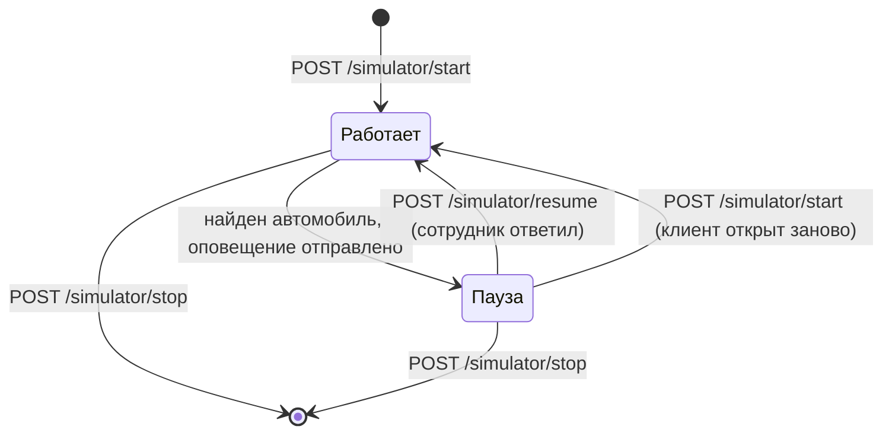

# Симулятор камер

Реальных камер в проекте нет. Их заменяет симулятор: он периодически «видит» один из разыскиваемых автомобилей сотрудника и создаёт оповещение, как если бы ГРЗ распознала камера на дороге. Код: [`app/services/simulator.py`](../app/services/simulator.py).

## Принцип работы

- Для каждого вошедшего сотрудника запускается **свой поток** симулятора. Клиент запускает его вызовом `POST /api/simulator/start` сразу после входа и останавливает при выходе (`/stop`).
- Раз в `DETECTION_INTERVAL_SECONDS` секунд (по умолчанию 60) симулятор делает шаг. Пока идёт ожидание, он каждую секунду проверяет, не остановили ли его.
- **Кандидаты:** записи розыска **этого сотрудника**, которые активны (`is_active`) и у которых `found_status` равен `Нет`. Если кандидатов нет или нет активных камер, шаг пропускается.
- Из кандидатов случайно выбирается автомобиль, из активных камер случайная камера.
- В записи розыска обновляются данные последней фиксации (`fix_date`, `fix_time`, `fix_address`, `fix_camera_id`), реакция сбрасывается в `Ожидает`.
- Создаётся запись в `alerts` и вызывается колбэк: сообщение уходит в WebSocket и (если настроено) на почту.

## Пауза и возобновление

После оповещения симулятор **ставит себя на паузу** и ничего не создаёт, пока сотрудник не ответит. Так одновременно существует не больше одного активного оповещения.

Повторный вызов `start` для уже работающего симулятора **снимает его с паузы**. Это сделано намеренно: если сотрудник обновил страницу, окно оповещения потеряно, ждать ответа на него бессмысленно, иначе симулятор остался бы на паузе навсегда.

## Что видит сотрудник после оповещения

1. Клиент показывает окно с ГРЗ, местом, временем и датой и открывает карту с выделенной камерой.
2. Сотрудник нажимает «Принять»: `PUT /alerts/{id}/reaction` со значением `Принято`.
3. Через заданный интервал клиент спрашивает «Автомобиль задержан?»: `PUT /alerts/{id}/found`:
   - «Да»: запись получает статус `Найден`, и симулятор больше не создаёт по ней оповещений;
   - «Нет»: статус остаётся `В розыске`, поиск продолжается.
4. После ответа клиент вызывает `POST /simulator/resume`.

Оповещения, оставшиеся без ответа, можно получить списком `GET /alerts/pending`: веб-версия показывает их на главной странице с кнопками «Принято» и «Отклонить».

## Настройка

| Параметр | Где | По умолчанию |
|---|---|---|
| Интервал между шагами, секунд | `DETECTION_INTERVAL_SECONDS` в `.env` | 60 |

Для демонстрации поставьте 10: оповещение придёт через 10 секунд после входа. Значение читается при старте сервера, после изменения `.env` сервер нужно перезапустить.

## Ограничения

- Симулятор живёт в памяти процесса: при перезапуске сервера он останавливается, клиент запускает его снова при следующем входе.
- Выбор автомобиля и камеры случайный, привязки к реальным маршрутам нет.
- Симулятор использует только записи розыска **вошедшего** сотрудника: чужие автомобили оповещений не создают.
