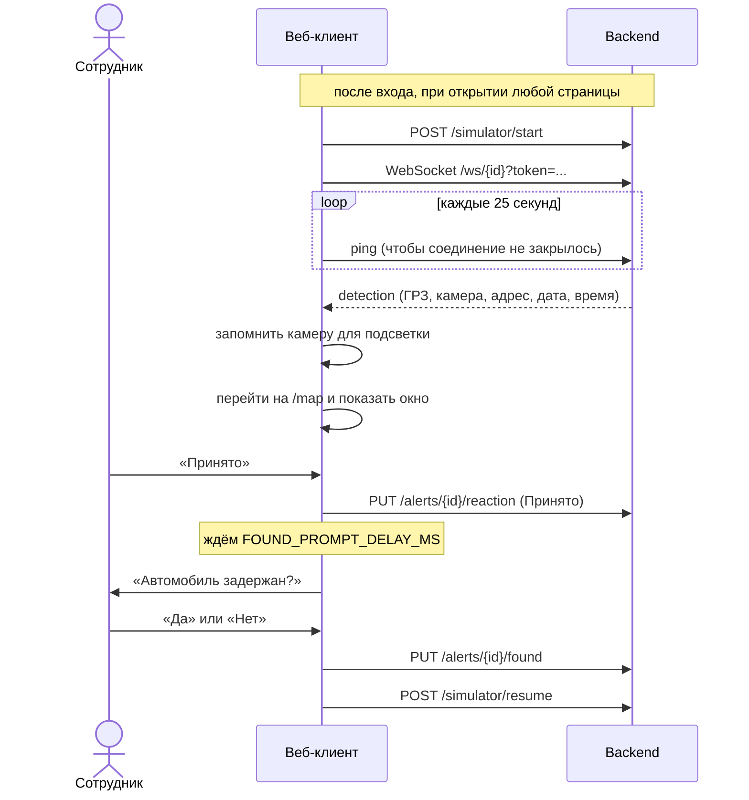

# Как приходит оповещение

Самая важная часть клиента: от неё зависит, увидит ли сотрудник сработавшую камеру. Код: [`src/contexts/AlertContext.jsx`](../src/contexts/AlertContext.jsx), окно: [`DetectionModal.jsx`](../src/components/DetectionModal.jsx).

## Последовательность

## Шаги

1. **Запуск.** Когда в Redux появляются сотрудник и токен, `AlertProvider` вызывает `POST /simulator/start` и открывает WebSocket `ws://.../ws/{id}?token=...`. Раз в 25 секунд клиент отправляет `ping`, чтобы соединение не закрывалось из-за простоя.
2. **Оповещение.** Сообщение `detection` сохраняется в состоянии, запоминается камера для подсветки, открывается страница `/map`, поверх неё показывается окно.
3. **Подсветка.** Карта берёт номер камеры (`camera_number`) и показывает `public/cam_N.png`: это карта, где камера №N выделена красным. Над картой появляется баннер с ГРЗ и адресом.
4. **«Принято».** Запрос `PUT /alerts/{id}/reaction`, окно закрывается, запускается таймер на `FOUND_PROMPT_DELAY_MS` (по умолчанию 60 секунд).
5. **Вопрос о результате.** По таймеру появляется «Автомобиль задержан?». «Да» переводит запись в статус `Найден`, «Нет» оставляет `В розыске`.
6. **Продолжение.** После ответа вызывается `POST /simulator/resume`: симулятор до этого стоял на паузе.

## Особенности

- **Обновление страницы.** Окно оповещения и таймер вопроса хранятся только в памяти. После обновления они пропадают, но запись остаётся со статусом «Ожидает» и видна на главной странице с кнопками «Принято» и «Отклонить». Повторный `POST /simulator/start` после обновления снимает симулятор с паузы.
- **Страница была закрыта.** Окно показать некому: оповещение сохраняется в базе с пометкой «не доставлено» (`notification_sent = false`) и при следующем открытии сайта видно на главной странице с кнопками «Принято» и «Отклонить». Если настроена почта, письмо при этом всё равно уходит.
- **Один сокет на сотрудника.** Если открыть сайт в двух вкладках, оповещения придут в последнюю открытую.
- **Подсветка** остаётся, пока сотрудник не ответит на вопрос о результате или не нажмёт «Снять подсветку» на карте.
- **Если запрос «Принято» не прошёл**, окно остаётся открытым и показывается ошибка: можно нажать ещё раз.
- **Кнопка «Отклонить»** есть только на главной странице у неотвеченных оповещений, в самом окне оповещения её нет.

## Для демонстрации

Чтобы не ждать минуту: в `backend/.env` поставьте `DETECTION_INTERVAL_SECONDS=10`, а в `web-frontend/.env` поставьте `REACT_APP_FOUND_PROMPT_DELAY_MS=10000` и перезапустите оба сервера.
