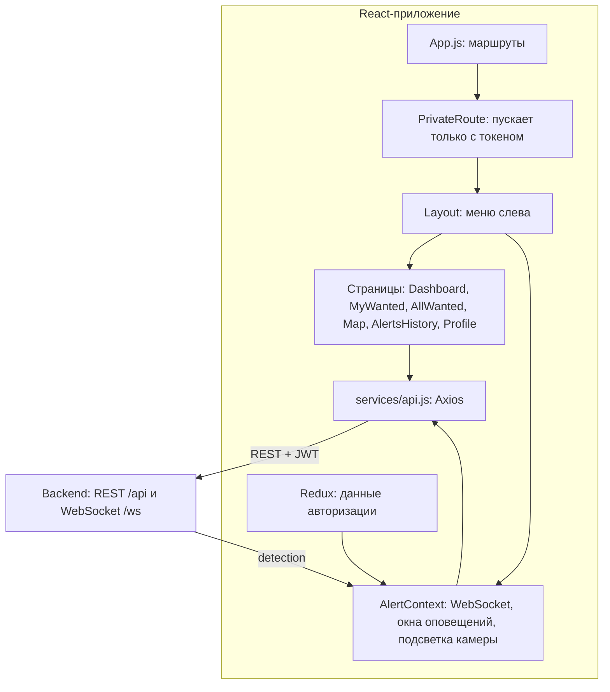

# Архитектура web-frontend

Приложение собрано на **Create React App**. Страницы переключаются без перезагрузки (React Router), данные берутся у backend по REST, оповещения приходят по WebSocket.

## Схема



## Структура `src/`

| Путь | Назначение |
|---|---|
| `index.js` | Точка входа: подключает Redux и роутер |
| `App.js` | Таблица маршрутов, контейнер уведомлений |
| `config.js` | Адреса и настройки из `.env`: `API_URL`, `WS_URL`, `FOUND_PROMPT_DELAY_MS` |
| `services/api.js` | Axios с адресом API, подстановкой токена и обработкой `401` |
| `store/` | Redux: данные авторизации (`authSlice`) |
| `contexts/AlertContext.jsx` | Запуск симулятора, WebSocket, оповещения, подсветка камеры на карте |
| `components/Layout.jsx` | Боковое меню, выход, обёртка `AlertProvider` |
| `components/PrivateRoute.jsx` | Защита страниц: без токена перенаправляет на `/login` |
| `components/DetectionModal.jsx` | Окна «Обнаружен автомобиль» и «Автомобиль задержан?» |
| `pages/` | Страницы, см. [pages.md](pages.md) |
| `public/` | Карта города `All_map.png` и 15 карт `cam_N.png` с камерой №N, выделенной красным |

## Маршрутизация

Все маршруты, кроме `/login`, вложены в `PrivateRoute` и `Layout`, поэтому меню видно на каждой странице, а гость попадает на вход.

```
/login        Login
/             PrivateRoute → Layout
  /dashboard    Dashboard   (адрес «/» перенаправляет сюда)
  /my-wanted    MyWanted
  /all-wanted   AllWanted
  /map          Map
  /history      AlertsHistory
  /profile      Profile
```

## Авторизация

1. `Login` отправляет `POST /auth/login`, получает токен и данные сотрудника.
2. Токен и данные сохраняются в Redux и в `localStorage` (ключи `token`, `user`), поэтому после обновления страницы сотрудник остаётся в системе.
3. Axios добавляет заголовок `Authorization: Bearer <токен>` ко всем запросам.
4. Если сервер отвечает `401` (токен истёк), токен удаляется и пользователь перенаправляется на `/login`.
5. «Выйти» останавливает симулятор (`POST /simulator/stop`), очищает токен и ведёт на `/login`.

## Состояние

| Что | Где хранится | Почему |
|---|---|---|
| Токен и сотрудник | Redux + `localStorage` | Нужны на всех страницах и должны пережить обновление |
| Оповещение, вопрос «задержан?», подсвеченная камера | `AlertContext` | Окна показываются поверх любой страницы, карта читает подсветку |
| Данные страниц (списки, история) | `useState` внутри страницы | Нужны только этой странице, при заходе загружаются заново |

## Оформление

Tailwind CSS: стили задаются классами прямо в JSX, цвета проекта (`primary`, `success`, `danger`) описаны в `tailwind.config.js`.

## Замечания

- Пакеты `leaflet` и `react-leaflet` указаны в `package.json`, но в коде не используются: карта сейчас показывается готовой картинкой. Их можно удалить или применить для интерактивной карты.
- Автоматических тестов у веб-клиента нет; ручная проверка всех кнопок описана в [testing.md](testing.md).
